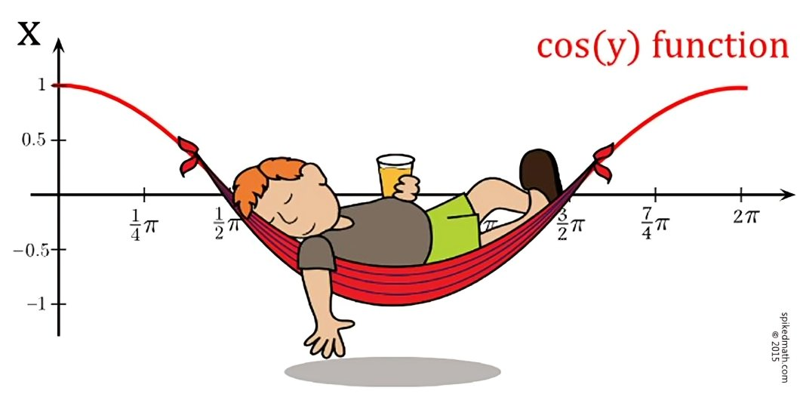

+++
title = "Coffee coding"
date = 2022-04-01
[taxonomies]
tags = ["coffee", "projects"]
[extra]
canonical.url = "https://www.getzola.org/documentation/content/page/"
canonical.redirect = true
canonical.use_as_post_link = true
+++

I drink coffee.

Original image: 

Resized image: 
{{ image(path="cos.jpeg", width=400, height=100, op="fit") }}
