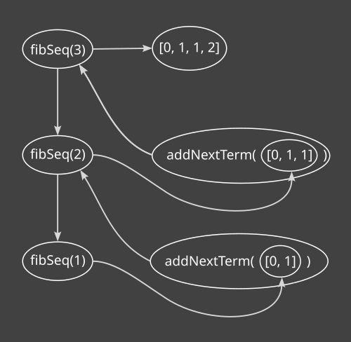

+++
title = "Shortest way to find Fibonacci sequence in JavaScript?"
date = 2022-02-16
[taxonomies]
tags = ["javascript", "problem-solving"]
[extra]
katex = true
+++

When you dive into programming, figuring out the Fibonacci sequence is a popular task, especially when you're getting the hang of recursion.

Let's first take a look at how the Fibonacci sequence looks, in case you haven't seen it before.

$$
0, 1, 1, 2, 3, 5, 8, 13, \ldots
$$

The first two terms are $0$ and $1$. Any other term is the sum of previous two terms. Very simple right!

There are many different ways to calculate this sequence. Today I will share with you the one that I figured out myself. My goal was to find shortest possible way to do it. I'm not sure if it is the one!

Here it goes:

```javascript
const fibSeq = (n) =>
  n < 2 ? [[0], [0, 1]][n] : ((s) => [...s, s.pop() + s.pop()])(fibSeq(n - 1));

console.log(fibSeq(10));
```

The output is:

```javascript
[0, 1, 1, 2, 3, 5, 8, 13, 21, 34, 55];
```

Some of you might be thinking of me as some sort of genius, but I'm not. It took me hours to craft this line. And even after solving it, I needed more time actually understand how it works.

I'm not here to preach about clever coding. Applying code-fu in real-world projects may not be appreciated by others, including your future self. Save it for the fun moments. Enough with the advice—let's dive into the breakdown of how it actually works!

The above code is actually two functions mashed up together. Let's first seperate them:

```javascript
const addNextTerm = (seq) => [...seq, seq.pop() + seq.pop()];

const fibSeq = (n) => (n < 2 ? [[0], [0, 1]][n] : addNextTerm(fibSeq(n - 1)));

console.log(fibSeq(10));
```

Let's make more clear by using `if`/`else` instead of ternary operator and not making clever use of `pop()` method of arrays.

```javascript
const addNextTerm = (seq) => [
  ...seq,
  seq[seq.length - 2] + seq[seq.length - 1],
];

const fibSeq = (n) => {
  if (n == 0) {
    return [0];
  } else if (n == 1) {
    return [0, 1];
  } else {
    return addNextTerm(fibSeq(n - 1));
  }
};

console.log(fibSeq(10));
```

In `fibSeq`, this version `addNextTerm` gives us the same result except the fact that it doesn't mutates its input which `pop()` does. Also note that mutating the input worked fine, since what we needed was the return value.

Now there is no magic except recursion. If you struggle with writing recursive code, here is the thinking model that I've figured out:

> Figure out the recursive pattern and apply it in code. Handle the cases that this pattern can't handle. Thinking this way never disapponited me.

Firstly, you have to figure out the _recursive pattern_. Here, for getting the Fibonacci sequence of first $n$ terms where $n \gt 1$, is the same as getting the Fibonnaci sequence of first $n - 1$ terms and then add an extra term in it. Notice how the idea "getting Fibonacci sequence of first $n$ terms where $n \gt 1$" involves itself. So this a _recursive pattern_. In the above code this pattern is in the `else` block.

After you figured out the _recursive pattern_, the next step is to find the cases when it doesn't works and address each of such cases. In the above code the `if` and `else if` blocks handle these cases.

Flowing with the control flow that happens inside a recursive algorithm is like going into the rabbit hole and getting outside again with the result. Sometimes doing this practice gives you a better understanding how computer actually interprets your recursive code. For the sake of this practice here is your travel guide into this rabbit hole for first `fibSeq(3)`:


